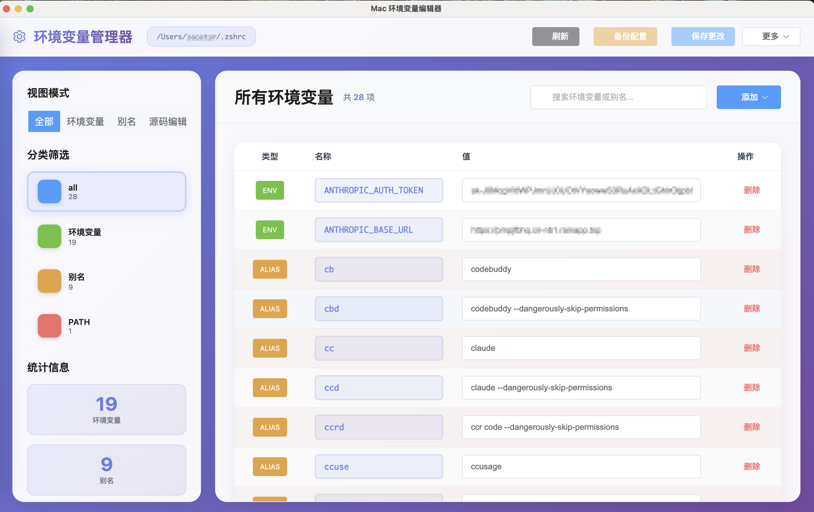

# Mac 环境变量编辑器

<div align="center">


一个现代化、直观的 macOS 环境变量和别名管理工具

[功能特性](#功能特性) • [安装使用](#安装使用) • [开发指南](#开发指南) • [贡献代码](#贡献代码)

</div>

## 📱 软件截图

<div align="center">



</div>

## 📋 功能特性

### 🎯 核心功能

- **环境变量管理**：完整的环境变量增删改查操作
- **别名管理**：Shell 别名的可视化管理
- **源码编辑**：直接编辑配置文件源码，支持自动保存和备份
- **实时保存**：修改即时保存到配置文件，无需重启
- **多格式支持**：支持 `.zshrc`、`.bash_profile`、`.bashrc`、`.profile` 等配置文件

### 🎨 用户体验

- **现代化界面**：采用毛玻璃效果和渐变设计
- **多视图模式**：表格视图和源码编辑模式自由切换
- **直观分类**：按类型（环境变量/别名/PATH）智能分类
- **强大搜索**：实时搜索环境变量和别名
- **统计面板**：一目了然的数据统计

### 🛡️ 安全保障

- **自动备份**：每次修改前自动创建备份
- **权限验证**：检测文件权限和所有权
- **内容安全**：验证变量语法和检测危险命令
- **错误处理**：完善的错误处理和用户反馈

## 🚀 安装使用

### 系统要求

- macOS 10.14 或更高版本
- Node.js 18+
- pnpm (推荐) 或 npm

### 快速开始

1. **克隆仓库**

   ```bash
   git clone https://github.com/156554395/mac-env-editor.git
   cd mac-env-editor
   ```

2. **安装依赖**

   ```bash
   pnpm install
   ```

3. **开发模式**

   ```bash
   pnpm run dev
   ```

4. **构建应用**
   ```bash
   pnpm run build
   ```

### 使用说明

#### 基本操作

1. **启动应用**：运行后自动检测你的 Shell 配置文件
2. **查看变量**：在主界面查看所有环境变量和别名
3. **添加变量**：点击"添加"按钮，选择类型并填写信息
4. **编辑变量**：直接在表格中修改变量值
5. **删除变量**：点击删除按钮确认删除

#### 高级功能

- **视图切换**：在"全部"、"环境变量"、"别名"、"源码编辑"之间切换
- **分类筛选**：按 PATH 相关、环境变量、别名等分类查看
- **源码编辑**：直接编辑配置文件，实时显示行数和字符统计
- **备份管理**：手动创建备份或查看自动备份
- **搜索过滤**：使用搜索框快速查找特定变量

## 🔧 开发指南

### 项目架构

```
mac-env-editor/
├── src/
│   ├── main/           # Electron 主进程
│   │   ├── main.ts     # 主进程入口和核心逻辑
│   │   └── preload.ts  # 预加载脚本
│   ├── renderer/       # Vue.js 渲染进程
│   │   ├── src/        # Vue 应用源码
│   │   └── utils/      # 工具模块
│   └── types/          # TypeScript 类型定义
├── dist/               # 构建输出
└── docs/               # 项目文档
```

### 技术栈

- **框架**：Electron + Vue 3 + TypeScript
- **UI 库**：Element Plus
- **构建工具**：Vite + Electron Builder
- **包管理**：pnpm
- **代码规范**：ESLint + Prettier

### 开发命令

```bash
# 开发模式 - 同时启动主进程和渲染进程
pnpm run dev

# 仅启动主进程开发
pnpm run dev:main

# 仅启动渲染进程开发服务器
pnpm run dev:renderer

# 构建应用
pnpm run build

# 构建主进程
pnpm run build:main

# 构建渲染进程
pnpm run build:renderer
```

## 🏗️ 核心模块

### 配置文件解析模块 (`configParser.ts`)

- 解析各种配置文件格式
- 生成符合规范的 export 语句
- 支持变量名和值验证

### 环境变量管理模块 (`envManager.ts`)

- 统一的环境变量操作接口
- 支持增删改查操作
- 变量分类和统计功能

### 安全管理模块 (`securityManager.ts`)

- 自动备份功能
- 操作日志记录
- 文件权限检查
- 安全模式验证

## 📝 更新日志

### v1.0.0 (2025-01-XX)

- ✨ 初始版本发布
- 🎨 现代化 UI 设计
- 🔧 完整的环境变量管理功能
- 🛡️ 安全的文件操作机制
- 📱 响应式界面设计

## 🤝 贡献代码

我们欢迎所有形式的贡献！请查看 [贡献指南](CONTRIBUTING.md) 了解详情。

### 贡献方式

- 🐛 报告 Bug
- 💡 提出新功能建议
- 📖 改进文档
- 🔧 提交代码

### 开发流程

1. Fork 本仓库
2. 创建功能分支 (`git checkout -b feature/AmazingFeature`)
3. 提交更改 (`git commit -m 'Add some AmazingFeature'`)
4. 推送分支 (`git push origin feature/AmazingFeature`)
5. 创建 Pull Request

## 📄 许可证

本项目基于 [MIT License](LICENSE) 开源协议。

## 🙏 致谢

- [Electron](https://electronjs.org/) - 跨平台桌面应用框架
- [Vue.js](https://vuejs.org/) - 渐进式 JavaScript 框架
- [Element Plus](https://element-plus.org/) - Vue 3 UI 组件库
- [Vite](https://vitejs.dev/) - 下一代前端构建工具

---

<div align="center">

**⭐ 如果这个项目对你有帮助，请给我们一个 Star！⭐**

Made with ❤️ for macOS developers

</div>
